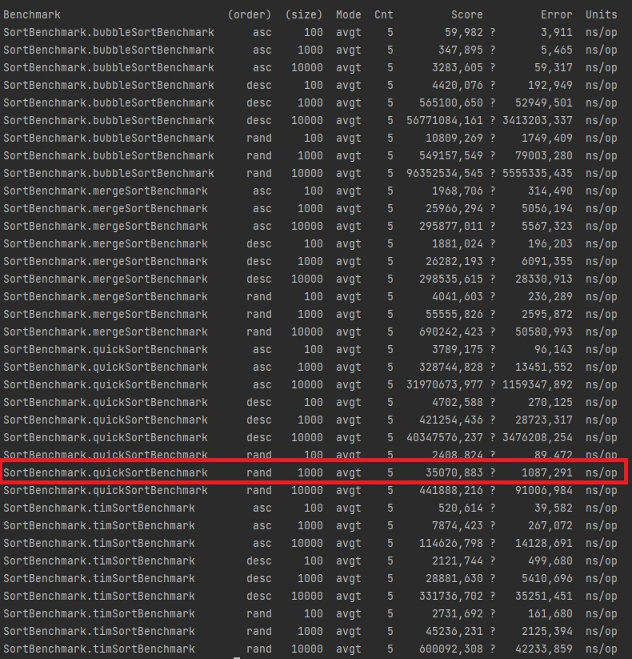

**Задание**

Сравнить разные способы сортировки по параметрам:
* Виды алгоритмов: MergeSort, TimSort, BubbleSort, QuickSort.
* Длина массивов: 100, 1_000 и 10_000. 
* Начальное состояние массивов: Восходящий, Нисходящий, Рандомизированный.

**Воспроизведение работы**

Находясь в директории проекта, собрать его с помощью maven командой:

```bash
  mvn clean package
```


...


Запустить jar файл командой

```bash
  java -jar target/benchmarks.jar
```


Проанализировать результаты



На пример, для случайного массива длиной в 1_000 элементов лучшие результаты показала сортировка 
**quickSort** (среднее время выполнения метода - 35_070 операций в нсек)
